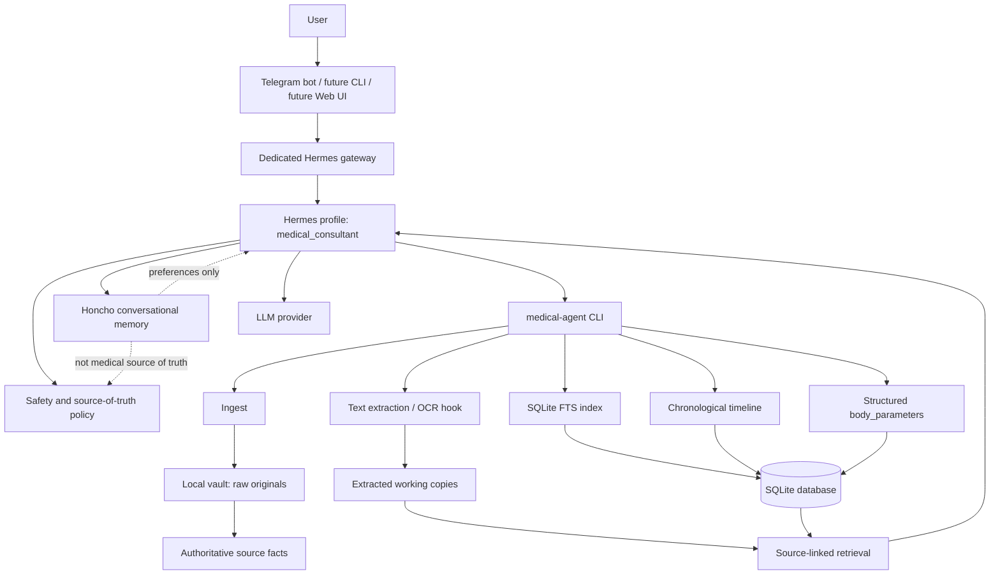

# Personal Medical Agent

A **self-hosted, privacy-first personal medical archive assistant** built around a local vault, source-linked retrieval, structured body-parameter indexing, a dedicated Hermes profile, and a Telegram-first user interface.

The project is designed for people who want to keep their own medical documents under their control while still being able to ask an AI assistant to find, summarize, and prepare source-linked context from their personal health archive.

> **Safety notice:** this is a personal archive and assistant, not a medical device. It does not diagnose, prescribe, cancel medication, or replace licensed medical care. Answers must distinguish source facts from model interpretation.

## What it does

- Stores original medical files in a local vault, outside Git.
- Calculates SHA-256 for stored source files.
- Keeps a SQLite index and a chronological timeline.
- Maintains a source-linked `body_parameters` layer for time-linked lab values, vital signs, ECG/imaging facts, exam findings, symptoms, medication/allergy self-reports, and other body-state facts.
- Classifies document rows with `document_role` and `role_note` so doctor-facing outputs can separate clinical sources from prescriptions, referrals, administrative/supporting records, context items, self-reports, and technical containers.
- Extracts text from documents and keeps extracted working copies separate from originals.
- Supports source-linked search and summary through the `medical-agent` CLI.
- Uses a dedicated Hermes profile named `medical_consultant`.
- Uses a dedicated Telegram bot/gateway for the medical assistant contour.
- Uses Honcho only for conversational and preference memory, not as the medical source of truth.

## Current project status

This repository is an early public-release candidate for a working personal MVP.

The current live MVP uses:

```text
Telegram dedicated medical bot
  -> systemd service: hermes-medical-consultant-gateway.service
  -> Hermes profile: medical_consultant
  -> medical vault CLI: /srv/hermes-medical/repo/.venv/bin/medical-agent
  -> local vault: /srv/hermes-medical/data
  -> SQLite: /srv/hermes-medical/data/db/medical.sqlite
```

The primary deployment path currently assumes an existing Hermes runtime. A standalone or Docker-based distribution mode is planned later; it is not the primary MVP path yet.

As of 2026-06-15, the live MVP also has operational structured body-parameter indexing for the current private archive snapshot. The code, schema, and documentation are stored in Git; private archive reports, backups, and medical data remain only under `/srv/hermes-medical/data` and must not be committed.

## Architecture at a glance



The important boundary is simple: **medical facts live in the local vault, SQLite, timeline, structured body parameters, extracted working copies, or explicit current user messages. Honcho memory may help with continuity and preferences, but it must not become the authoritative medical record.**

## Roadmap at a glance


The detailed roadmap is maintained in [`docs/ROADMAP.md`](docs/ROADMAP.md).

## Quick start: current MVP path

This path is intended for a technical user with an Ubuntu server and an existing Hermes runtime.

### 1. Prepare directories

```bash
sudo install -d -m 755 -o root -g root /srv/hermes-medical
sudo install -d -m 750 -o hermes -g hermes /srv/hermes-medical/repo
sudo install -d -m 700 -o hermes -g hermes /srv/hermes-medical/data
sudo install -d -m 700 -o hermes -g hermes /srv/hermes-medical/config
```

### 2. Clone the repository

```bash
sudo -u hermes -H git clone https://github.com/alldevice/personal-medical-agent.git /srv/hermes-medical/repo
sudo -u hermes -H git -C /srv/hermes-medical/repo status --short
```

### 3. Create local config

```bash
sudo -u hermes -H cp /srv/hermes-medical/repo/config/.env.example /srv/hermes-medical/config/.env
sudo chmod 600 /srv/hermes-medical/config/.env
```

Store real Telegram tokens and provider credentials only on the server. Do not commit them.

### 4. Install the CLI

```bash
sudo -u hermes -H python3 -m venv /srv/hermes-medical/repo/.venv
sudo -u hermes -H /srv/hermes-medical/repo/.venv/bin/python -m pip install --upgrade pip
sudo -u hermes -H /srv/hermes-medical/repo/.venv/bin/pip install -e /srv/hermes-medical/repo
sudo -u hermes -H /srv/hermes-medical/repo/.venv/bin/medical-agent init
```

### 5. Run a smoke test

```bash
sudo -u hermes -H bash -lc 'echo "synthetic test document" > /tmp/medical-test.txt'
sudo -u hermes -H /srv/hermes-medical/repo/.venv/bin/medical-agent ingest --file /tmp/medical-test.txt --type "test-document" --date "2026-06-12" --comment "MVP smoke test"
sudo -u hermes -H /srv/hermes-medical/repo/.venv/bin/medical-agent timeline --limit 5
sudo -u hermes -H rm -f /tmp/medical-test.txt
```

For the full installation flow, read [`docs/RUNBOOK.md`](docs/RUNBOOK.md).

## Documentation map

Read these first:

- [`docs/LLM_CONTEXT.md`](docs/LLM_CONTEXT.md) — compact context for ChatGPT/LLM agents entering the repository.
- [`docs/CURRENT_SYSTEM.md`](docs/CURRENT_SYSTEM.md) — current live system source of truth.
- [`docs/RUNBOOK.md`](docs/RUNBOOK.md) — installation and verification runbook.
- [`docs/OPERATIONS.md`](docs/OPERATIONS.md) — daily operations, restart, health checks, troubleshooting.
- [`docs/CHANGE_MANAGEMENT.md`](docs/CHANGE_MANAGEMENT.md) — branches, pull requests, Git pull, and server updates.
- [`docs/ROADMAP.md`](docs/ROADMAP.md) — detailed future work.
- [`docs/INSTALLATION_HISTORY.md`](docs/INSTALLATION_HISTORY.md) — initial MVP setup history.
- [`docs/ARCHITECTURE.md`](docs/ARCHITECTURE.md) — architecture details.
- [`docs/SAFETY_POLICY.md`](docs/SAFETY_POLICY.md) — medical safety boundary.
- [`docs/DATA_MODEL.md`](docs/DATA_MODEL.md) — current data model notes.
- [`docs/FULL_CONTENT_INDEXING.md`](docs/FULL_CONTENT_INDEXING.md) — full-content extraction and composite-source indexing contract.
- [`docs/BODY_PARAMETER_INDEXING_STATUS.md`](docs/BODY_PARAMETER_INDEXING_STATUS.md) — structured body-parameter indexing status and operational acceptance.

## For ChatGPT and other LLM agents

The README is intentionally human-friendly. It should not replace the operational source-of-truth documents.

When an LLM is asked to inspect or continue work in this repository, it should read:

1. [`docs/LLM_CONTEXT.md`](docs/LLM_CONTEXT.md)
2. [`docs/CURRENT_SYSTEM.md`](docs/CURRENT_SYSTEM.md)
3. [`docs/ROADMAP.md`](docs/ROADMAP.md)
4. [`docs/RUNBOOK.md`](docs/RUNBOOK.md)
5. [`docs/CHANGE_MANAGEMENT.md`](docs/CHANGE_MANAGEMENT.md)

This keeps the project understandable for new humans while preserving a precise entry point for AI-assisted maintenance.

## Safety and privacy boundaries

Never commit:

```text
/srv/hermes-medical/data/**
/srv/hermes-medical/config/.env
/home/hermes/.hermes/profiles/medical_consultant/.env
/home/hermes/.hermes/profiles/medical_consultant/auth.json
/home/hermes/.hermes/.env
/home/hermes/.hermes/auth.json
```

Before making this repository public, perform a manual audit for:

- real medical data;
- Telegram tokens;
- provider/API credentials;
- OAuth state files;
- private hostnames or secrets;
- accidental logs or screenshots containing sensitive data.

## Normal update from GitHub to server

After a PR is merged to `main`:

```bash
cd /
sudo -u hermes -H git -C /srv/hermes-medical/repo status --short
sudo -u hermes -H git -C /srv/hermes-medical/repo pull --ff-only
sudo -u hermes -H /srv/hermes-medical/repo/.venv/bin/pip install -e /srv/hermes-medical/repo
sudo -u hermes -H /srv/hermes-medical/repo/.venv/bin/medical-agent init
sudo systemctl restart hermes-medical-consultant-gateway.service
systemctl status hermes-medical-consultant-gateway.service --no-pager -l
```

## License

A license should be selected before public release. Until then, treat the project as source-available for review by the repository owner and explicitly authorized collaborators only.
